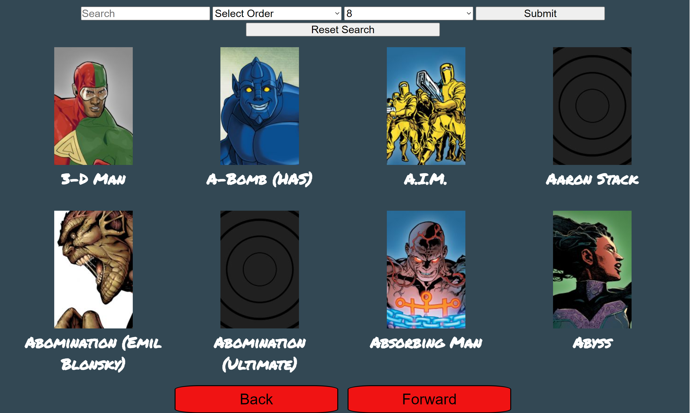
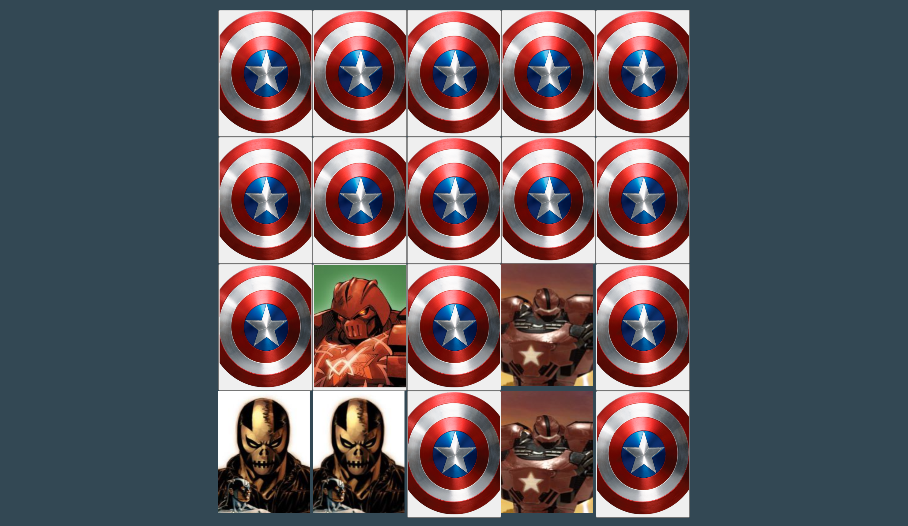

# GET-It-DONE

Hi! - welcome to _Marvel Catalog Viewer_!

This App uses the Marvel Api to display their entire collections of Characters, Comics, Creators, Events, and Series in an organized and easy to use fashion.  I have also included a character match game.

## Home Page

## View Collection

## Match Game

### Tools used

_Marvel Catalog Viewer_ is built with react.  I used hooks for most of the functionality and styled components for the css.  React-Card-Flip package was used to make the animation in the Match Game.  Axios with Async Await is used for calling the Api to populate the pages.

### How to get started

**First clone the repo**

**yarn install**

**yarn start**

### Site hosted on netlify here 

[Marvel-Catalog-Viewer](marvel-catalog-viewer.netlify.app)
